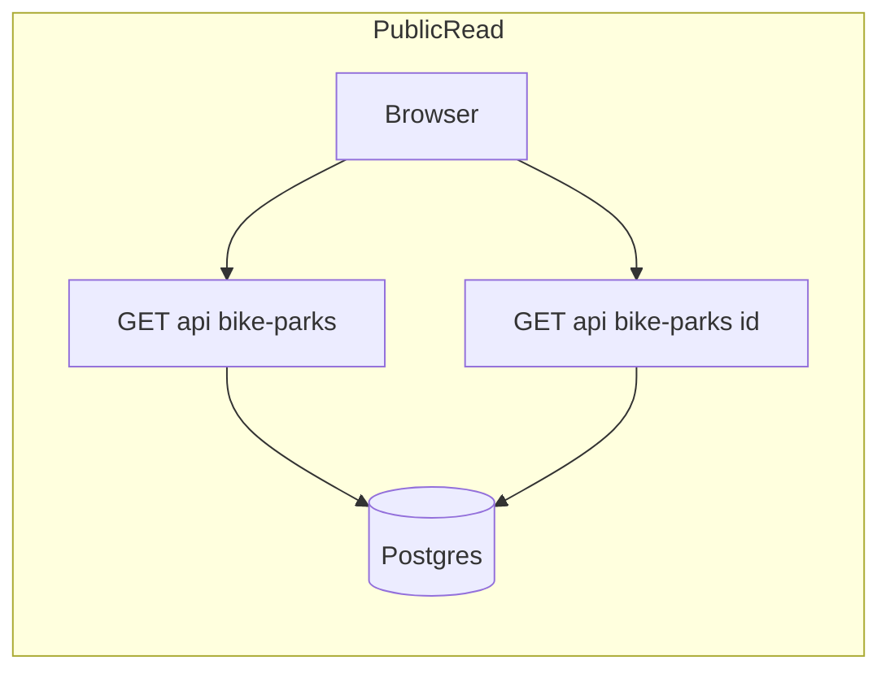
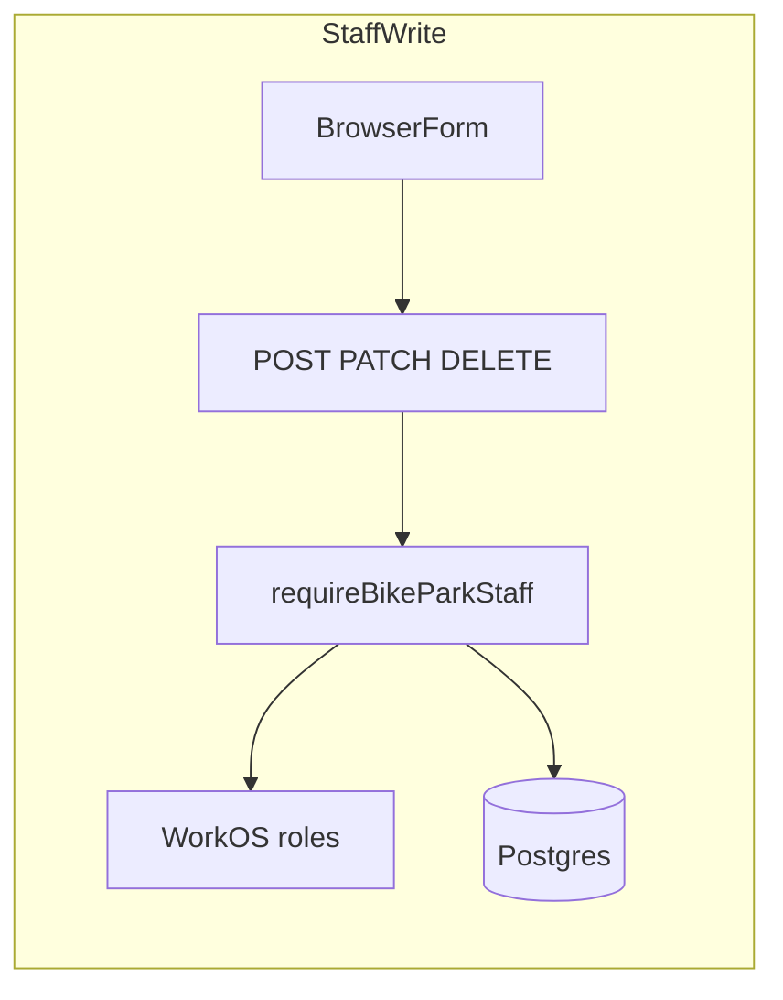
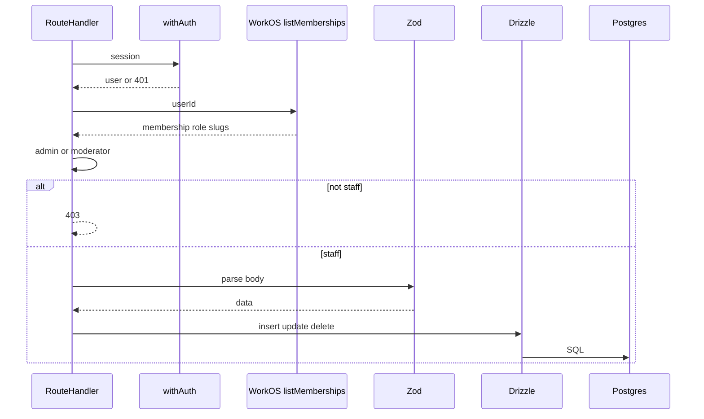
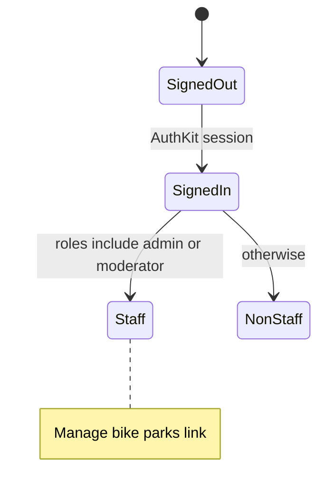

# Shredmap — application documentation

**Shredmap** is a community-oriented site for discovering **UK mountain bike parks**. The main experience is a **full-screen Google Map** with database-backed markers; users can browse **without signing in**. The stack is **Next.js (App Router)**, **Postgres**, **Drizzle ORM**, **Tailwind CSS**, and **WorkOS AuthKit** (required — see `assertWorkOsConfigured()` in `lib/auth/workos-env.ts`).

---

## User-facing features

### Map (homepage)

- **Route:** `/` (`app/(marketing)/page.tsx`) loads `HomeMapLoader`, which dynamically imports the client map (`ssr: false`) so the Google Maps JS API only runs in the browser.
- **Markers:** Loaded from `GET /api/bike-parks` via `lib/bike-parks/fetch-bike-parks-for-map.ts`, which validates the JSON and passes points to `replaceBikeParkMarkersOnMap` (`components/map/replace-bike-park-markers.ts`). Map pins use each park's `pinLogoUrl` when available, falling back to `logoUrl` and then the default Google marker. Requests respect **abort signals** so rapid navigation or remounts do not apply stale markers.
- **Selection:** Choosing a marker sets a selected park id; details are fetched from `GET /api/bike-parks/[id]` (`components/map/shred-map.tsx`).
- **Layout:** **Mobile-first** — narrow viewports use a **full-screen detail panel**; **desktop** uses a **side panel** so the map stays visible (`park-detail-panel.tsx`, `shred-map.tsx`).
- **Chrome:** Top bar with branding and auth/navigation (`map-chrome.tsx`). Signed-out users see sign-in/sign-up actions; signed-in users get a themed hamburger menu with quick links for **Map**, **Account**, **Admin**, optional **Manage parks** (when WorkOS roles include `admin` or `moderator`), and **Sign out**. **`/sign-in`** and **`/sign-up`** are server routes that immediately redirect to WorkOS AuthKit via `getSignInUrl` / `getSignUpUrl` (`lib/auth/workos-redirect.ts`; optional `?redirect=` for return path).
- **Park detail footer:** Signed-out users see a prompt to sign in for community features; signed-in users see account messaging; users with staff roles also get a **Manage bike parks** link (`park-detail-panel.tsx`).
- **Park detail staff action:** Staff users (`admin` / `moderator`) also see an **Edit park** button in the pin side panel that deep-links directly to the per-park admin route (`/admin/bike-parks/[parkId]`).

### Authentication

**WorkOS AuthKit only** — required env vars are validated with **`assertWorkOsConfigured()`** (`lib/auth/workos-env.ts`); the app throws if they are missing. Hosted AuthKit flow; callback **`GET /callback`** (`app/callback/route.ts`) runs **`syncWorkOsUserToDatabase`** so each WorkOS user has a row in `users` (`workOsUserId`). Root **`proxy.ts`** runs **`authkitProxy`** from `@workos-inc/authkit-nextjs` (Next.js convention; replaces deprecated `middleware.ts`). The **`(app)`** layout uses **`withAuth({ ensureSignedIn: true })`** for `/dashboard`, `/account`, `/admin`, `/chat`.

**Authorization source of truth:** WorkOS is the only authority for role/permission data. The app must not persist user authorization roles in Postgres. `/api/workos/roles` reads the canonical AuthKit session schema from `withAuth()` (`roles`, `role`, `permissions`), and the account page displays those WorkOS-derived values.

### Inherited starter surfaces

The repo still includes **marketing**, **catalog** (`/items`), **dashboard**, **account**, **admin**, and **AI chat** from the original boilerplate. See [`boilerplate.md`](./boilerplate.md) for route groups and patterns. Product focus for Shredmap is the **map + bike parks**; other areas may remain demos until extended.

---

## API routes (bike parks)

| Method | Path | Who | Notes |
|--------|------|-----|-------|
| `GET` | `/api/bike-parks` | Public | `{ parks }` — minimal fields for map markers (`id`, `name`, `latitude`, `longitude`, optional `pinLogoUrl` / `logoUrl`). |
| `GET` | `/api/bike-parks/[id]` | Public | Full `bike_parks` row for the detail panel. |
| `POST` | `/api/bike-parks` | Staff | Create park; JSON body validated with Zod (`lib/bike-parks/api-schemas.ts`). Includes `facilities` as a predefined list of allowed slugs (stored as `amenities`). Server assigns UUID `id`. |
| `PATCH` | `/api/bike-parks/[id]` | Staff | Partial update; at least one field required. Supports updating `facilities` from the same predefined slug list. |
| `DELETE` | `/api/bike-parks/[id]` | Staff | Deletes row; `park_reviews` cascade. |

**Staff** means a signed-in WorkOS user whose role slugs include **`admin`** or **`moderator`** (from the AuthKit session and organization memberships — same aggregation as `/api/workos/roles`). Enforced in `requireBikeParkStaff()` (`lib/auth/bike-park-staff.ts`) on every mutating handler. Membership role-slug lookups are cached per WorkOS user (TTL configured in `lib/auth/bike-park-staff.ts`) to reduce repeat WorkOS latency during route transitions and staff actions, and the cache tag is explicitly invalidated during sign-out. Missing session → **401**; signed in but not staff → **403**.

### Staff UI

- **`/admin/bike-parks`** — staff-only directory with instant name search and infinite scrolling, sorted alphabetically; selecting a park opens its editor.
- **`/admin/bike-parks/[parkId]`** — per-park editor route for updating/deleting a specific listing, used by both the manage list and map side panel. Facilities are edited as selectable predefined tags (no freeform entry).
- Moderator **example** for manual QA: [Bull Track Bike Park](https://bulltrackbikepark.co.uk/) — name e.g. `Bull Track Bike Park`, website `https://bulltrackbikepark.co.uk/`, short description, coordinates near Crowborough (~`51.058`, `-0.161`).

### Diagrams

Other JSON routes (`/api/user`, `/api/organization`, `/api/workos/roles`, `/api/items`, `/api/ai/chat`, `/api/webhooks`, `/api/admin/items`) follow the boilerplate; protect or extend as needed.

### E2E / Playwright

- **`pnpm test:e2e`** runs Playwright (`e2e/`, video on; output under `test-results/`).
- Optional password-auth bootstrap: set **`ENABLE_E2E_TEST_AUTH=1`**, **`TEST_APP_USERNAME`** (email), **`TEST_APP_SECRET`** (password), run the app, then **`POST /api/e2e/session`** (used by the test `beforeAll`) to mint an AuthKit cookie via `authenticateWithPassword`. **Do not commit secrets.** The test creates and deletes the Bull Track sample on `/admin/bike-parks`.

---

## Data model (bike parks)

Table `bike_parks` (see `lib/db/schema.ts`) stores:

- Identity and position: `id` (UUID), `name`, `latitude`, `longitude`
- Presentation: `description`, `logoUrl`, `pinLogoUrl`, `galleryImageUrls`
- Trail stats: `trailCount`, `totalTrailLengthKm`
- Ratings: `ratingScore`, `ratingVoteCount`
- Facilities: `amenities` (JSON object of booleans). Staff editing uses a controlled predefined vocabulary from `lib/bike-parks/facilities.ts`.
- Links and business: `primaryCtaUrl`, `primaryCtaType`, `payment`, `status`
- **Opening hours:** `openingHours` (JSON)
- **Provenance:** `sourceUrl`
- Timestamps: `createdAt`, `updatedAt`

`park_reviews` links `bike_parks` to `users` with `rating` and `body` — intended for logged-in reviews; UI/API may be incomplete until built out.

---

## Seed data and imports

- **Seed file:** `data/bike-parks.seed.json` — replace or extend this file and run `pnpm db:seed` to refresh local DB rows (see `lib/bike-parks/seed-from-json.ts` and `lib/db/seed.ts`).
- **Postgres** is the source of truth for markers in production.

Historical context: early iterations referenced seeding from external MTB directory APIs; the maintained path for this repo is **JSON seed + migrations**, unless you add a new import script.

---

## Environment variables

See **`.env.example`** in the repo root. Highlights:

| Variable | Purpose |
|----------|---------|
| `POSTGRES_URL` or `DATABASE_URL` | Postgres connection string. **Neon:** set either variable to the string from the Neon dashboard (hosts end in `neon.tech`; the app uses Neon's HTTP driver on Vercel). For local Docker, see `pnpm db:setup`. |
| `NEXT_PUBLIC_GOOGLE_MAPS_API_KEY` | Browser key with **Maps JavaScript API** enabled (homepage map) |
| `BASE_URL` | Canonical URL (links, callbacks) |
| `WORKOS_API_KEY`, `WORKOS_CLIENT_ID`, `WORKOS_COOKIE_PASSWORD`, `NEXT_PUBLIC_WORKOS_REDIRECT_URI` | WorkOS AuthKit (required; must match dashboard; redirect URI typically `…/callback`) |
| `OPENAI_API_KEY`, `OPENAI_MODEL` | Optional — `/chat` and `/api/ai/chat` |
| `ENABLE_E2E_TEST_AUTH`, `TEST_APP_USERNAME`, `TEST_APP_SECRET` | Optional — Playwright + `/api/e2e/session` (see E2E section) |

### Vercel: “Development” vs hosted deploys

In the dashboard, **Development** is where you store variables for **local** work (`vercel env pull`, `vercel pull --environment=development`). It is **not** the same as a **Preview** deployment.

Hosted test URLs always come from **Preview** (`vercel deploy` without `--prod`) or **Production** (`vercel deploy --prod`), unless you add a **custom environment**.

`vercel deploy --target development` fails with *Custom environment not found* because the CLI treats any target other than `production` / `preview` as a **custom environment slug**, and the built-in Development bucket is not a deployable custom environment in that API.

**To get a stable hosted URL that uses the same secrets as Development:**

1. In Vercel: **Project → Settings → Environments → Create environment**.
2. Choose a slug (this repo assumes **`dev`**) and set **type** / options so it matches your workflow; use **Import variables from → Development** (or copy them) so keys match what you use locally.
3. Deploy from the repo root:

   `pnpm vercel:deploy:dev`

   (runs `vercel deploy --target dev`.)

If you prefer another slug, change the script in `package.json` or run `vercel deploy --target <your-slug> -y`.

Until that custom environment exists, use **`vercel deploy --target preview`** (or plain `vercel deploy`) for a hosted Preview deployment using **Preview**-scoped variables.

---

## Key source locations

| Area | Path |
|------|------|
| Map UI | `components/map/` — `shred-map.tsx`, `park-detail-panel.tsx`, `map-chrome.tsx`, `home-map-loader.tsx`, `replace-bike-park-markers.ts` |
| Client fetch helpers | `lib/bike-parks/fetch-bike-parks-for-map.ts` |
| DB queries | `lib/db/queries.ts` — bike park reads/writes, user/org helpers |
| Staff bike parks | `lib/auth/bike-park-staff.ts`, `lib/auth/bike-park-staff-roles.ts`, `app/(app)/admin/bike-parks/` |
| Schema | `lib/db/schema.ts` — `bikeParks`, `parkReviews`, `users` |
| WorkOS sync | `lib/auth/sync-workos-user.ts`, `lib/auth/workos-env.ts` |
| Request proxy (WorkOS) | `proxy.ts` — `authkitProxy` |

---

## Planned / follow-up (from product notes)

Document these in this file when they ship:

- Review submission (authenticated) and listing on park detail

---

## Related reading

- [`AGENTS.md`](../AGENTS.md) — short agent-oriented vision and constraints
- [`boilerplate.md`](./boilerplate.md) — starter layout and customization
- [`.env.example`](../.env.example) — full env list
